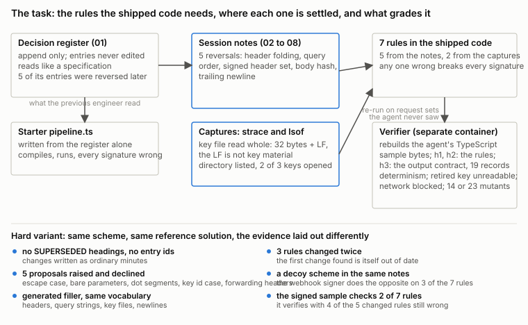
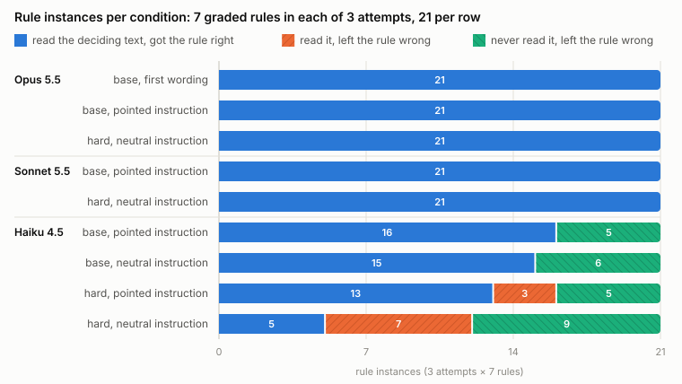

# Validate the Benchmark Before Trusting the Score: Spec Gaps, Verifier Gaps and Presentation Hardening in an Evidence-Driven API Migration Task

**Tatiana Rogel** 
LaunchPeak Studio AI 
tatianarogel03@gmail.com

September 30, 2026

## Abstract

I present a Terminal-Bench style task in which a coding agent must finish a TypeScript port of a request signer by recovering the final signing scheme from about 75k tokens of migration documents. Five of the seven rules the agent needs were reversed in meeting notes after being recorded in a decision register that reads like a specification, and two exist only in syscall captures of the system being replaced. The task is graded byte-exact against hidden request sets re-run from the agent's own code in a separate container. Before trusting any model result I validated the grader: mutation testing with 23 single-fault variants of the reference solution, a red-team pass in which every claimed gap had to be proved by running code over the graded sets, and a per-attempt diagnosis that reads which form of each rule an attempt implemented and whether its trajectory ever showed the text that settles it. The validation found two grading errors that would otherwise have been reported as model behaviour. The first version of the instruction scored Claude Opus 5.5 at 0 of 3 while every signing rule in its code was correct, because two rules of the output contract were never stated. The corrected task then awarded a full score to a Claude Haiku 4.5 attempt that verified any `Authorization` header whose signature matched, whatever key the header named, because no hidden record exercised that sentence; a third hidden set now grades the contract sentence by sentence, and every stored attempt was re-graded. On the validated task, a presentation-hardened variant that removes every announcement of a changed rule, adds rules that changed twice and proposals that were declined, and plants a decoy scheme in the same notes, did not change the outcome for Opus 5.5 or Claude Sonnet 5.5, which solved both variants in every attempt by collapsing the generated filler with a few commands. It did change what Haiku 4.5 does with text it has already read: on the base documents Haiku applied every deciding passage it retrieved (31 of 31 rule instances); on the hard documents it applied 18 of 28; one paragraph in the instruction pointing at the notes brought that to 13 of 16. The contribution is a task whose grader has been checked against itself, and tooling that turns a pass or a fail into a statement about which rule was wrong, what the agent read, and whether it applied what it read.

## 1 Introduction

Agent benchmarks report pass rates. A pass rate rests on three things: the instruction the agent was given, the verifier that scored it, and the reading of the trajectory that explains the number. Each can be wrong in a way that looks exactly like a model failure or a model success. This paper is a worked example of checking all three on one task, and of what the checks found.

The task comes from document intelligence work, where the most common failure I see is a system that takes the first authoritative looking statement it finds and never checks whether something later overrode it. The benchmark turns that into an engineering job. A decision register reads like a specification and is append only by policy, so reversed decisions sit in it looking current. The reversals live in meeting notes. Two further rules exist only as evidence in an `strace` and an `lsof` of the system being replaced. The agent must ship code that signs byte-for-byte like the reference on request sets it never saw.

Three findings came out of validating the task rather than running models on it.

1. **A spec gap that read as a model failure.** The first instruction never said what the `signature` field holds on a rejected verification, nor whether `signature=deadbeef` is a malformed header or a wrong signature. Opus 5.5 got every signing rule right in 3 of 3 attempts and scored 0 of 3 (Section 3.2).
2. **A verifier gap that read as a model success.** With the instruction fixed, the hidden request sets exercised the signing rules but not the output contract. A Haiku 4.5 attempt that verified any `Authorization` header whose signature matched, whatever `keyId` it named, scored a full reward. Seven contract mutants showed the grader let 5 of 7 such departures through; a third hidden set built sentence by sentence from the instruction catches them, and a red-team pass found 11 more that it now catches (Sections 3.3 and 3.4).
3. **Presentation hardening separated models by what they do with text they have read, not by whether they read it.** Removing every announcement of a changed rule, adding intermediate and declined rules and a decoy scheme did nothing to Opus 5.5 or Sonnet 5.5, which strip the generated filler with a few commands and read what is left. It changed Haiku 4.5: on the base documents it applied every deciding passage it had in front of it; on the hard documents it applied 18 of 28, and a one-paragraph pointer in the instruction brought that to 13 of 16 (Section 6).

The repository that accompanies this paper holds both variants of the task, the reference solution, the mutants, the red-team scripts, the diagnosis tooling, every stored attempt, and every number reported here.

## 2 The task

### 2.1 What the agent has to do

The agent is told that a Perl request signer is being retired and that a TypeScript replacement, `/app/src/pipeline.ts`, was started by someone who has left. It compiles and writes evidence, and the gateway rejects every signature it produces. The pipeline reads a JSON array of HTTP request records on stdin, signs each one under GW-HMAC-SHA256 or verifies it if it carries an `Authorization` header, and writes one compact JSON evidence object per line with exactly the keys `seq`, `key_id`, `method`, `path`, `outcome`, `signature`, `canonical_sha256` and, on rejection, `reason`. Four rejection reasons exist and are checked in a stated order.

The starter was written from `/app/dossier/01-decision-register.md`. The register is append only and says so: entries are never edited, so a reversed decision sits there looking authoritative. Five of its entries were reversed later in meeting notes elsewhere in the dossier (Table 1). Any one of them left unfixed changes every signature.

**Table 1.** Register entries the meeting notes reversed.

| Entry | The register says | The notes changed it to |
|---|---|---|
| GW-041 | header values signed as received | whitespace folded |
| GW-017 | query parameters sorted by name only | by name, then value, bytewise |
| GW-023 | only `x-gw-*` headers signed | every header except `authorization` |
| GW-009 | an empty body signs the token `UNSIGNED` | always the SHA-256 of the body |
| GW-052 | the canonical string ends in a newline | no trailing newline |

Two more rules appear in no document. The key files are 33 bytes, 32 of key and a trailing newline that is not key material; only the `strace` shows the 33-byte read, and only the 32-byte key reproduces the one already-signed record in the sample. One key file sits in the key directory off the active roster: the `strace` lists the directory and opens only two files, the `lsof` holds only those two, so a request naming the third key must be rejected, not signed.

**Figure 1.** Where the 7 rules come from and what grades them. The hard variant keeps the rules and the reference solution and changes only the presentation.

### 2.2 The documents

The dossier is 16 Markdown files, about 317 KB and about 75k tokens: the register, 7 session notes from kickoff to rollout, and 8 appendices (onboarding matrix, load test observations, key rotation runbook, error taxonomy, rollback procedure, capacity notes, support escalations, dashboards). In the base variant each reversal sits under a heading of the form `### GW-041 - SUPERSEDED` and the surrounding text is boilerplate that says it does not affect the scheme.

### 2.3 Grading

The verifier runs in a separate container after the agent's is gone and trusts nothing the agent left behind. It recompiles the agent's TypeScript, so a hand-written evidence file scores nothing, and checks six independent things: the evidence file for the shipped sample matches the approved bytes; the rebuilt pipeline reproduces approved bytes on three hidden request sets (`h1` and `h2` exercise the signing rules, `h3` the output contract); two runs over the same input give identical bytes; the off-roster key file is made unreadable before one run, which must be unaffected; one run happens with every proxy variable pointed at a closed port and the sources are scanned for network APIs; and the eight sample records carry the right outcome and rejection reason. Agent code runs as a user that owns nothing, and the reward file sits where that user cannot write.

### 2.4 The hard variant

The hard variant keeps the scheme and the reference solution byte for byte and changes only how the evidence is laid out, so any difference in scores comes from presentation (Table 2).

**Table 2.** What the hard variant changes.

| | Base | Hard |
|---|---|---|
| Changed rules | under a heading with the entry id and `SUPERSEDED` | ordinary minutes, no entry ids, none of the words a search would look for |
| Rules that changed twice | none | 3: query ordering gained then lost percent-decoding; the signed set gained `content-type`, then everything; the `UNSIGNED` token was narrowed, then removed |
| Changes raised and not adopted | none | 5: escape case, bare parameters, dot segments, key id case, forwarding headers |
| A second scheme in the same notes | no | the outbound webhook signer, which does the opposite on 3 of the 7 rules |
| Text around the decisions | boilerplate that says it is not about the scheme | generated text about headers, query strings, key files and newlines |
| Captures | commented | raw |
| Off-roster key | `gw-legacy-99`, containing `retiredkeymaterial_do_not_use` | `gw-prod-03`, indistinguishable from the others |
| The signed sample record | carries `Host`, so it checks 3 of the 7 rules | carries only `x-gw-*` headers, so it checks 2 |

The last row is the trap the variant is built around. Fix the trailing newline and the key length in the starter and the sample's signed record verifies, with 4 of the 5 changed rules still wrong. The dossier is generated from a fixed seed with every hand-written passage listed next to the sentence pools the filler is drawn from, and the request sets are signed by a second implementation written separately from the reference solution, so the reference reproducing them in CI is itself a check.

## 3 Validating the verifier

### 3.1 Mutation testing

The repository grades the task against itself on every push. It builds both images, produces an `/app` for each case, hands it to a fresh verifier container the same way the harness does, and checks the reward: the reference solution must score 1; an agent that does nothing, 0; the shipped starter built and run as is, 0; and every mutant, 0. A mutant is the reference solution with exactly one thing wrong, and it must compile and run before it is graded, so a 0 means the tests caught wrong output and not a build error. There are 7 rule mutants, one per rule; 9 hard-variant mutants that each adopt a rule the notes held for a while, trialled, or turned down; and 7 output-contract mutants (Section 3.3). The script prints which test caught each mutant.

That column is where the first lesson was. The query-sort mutant is caught only by the hidden sets: the sample's one repeated query name arrives with its values already in order, so sorting by name alone reproduces the sample byte for byte. Without `h1` and `h2` the rule would not have been graded at all. In the hard variant three mutants (decoded-value sorting, uppercased escapes, any-case key ids) are each caught by a single hidden set.

### 3.2 The spec gap

The first version of the instruction did not say what `signature` holds when a verification is rejected, nor whether a well-formed header carrying a short or non-hex signature is `malformed-authorization` or `signature-mismatch`. Opus 5.5 ran 3 attempts against it and scored 0 of 3. The per-attempt diagnosis of Section 4 shows that all 3 attempts implemented every one of the 7 rules correctly, 21 of 21 rule instances, and differed from the reference only on those two points. The agent made sensible choices; the reference made different ones; the bytes could not match. Both rules were written into the instruction and the next 3 attempts scored 3 of 3. The first 3 attempts are kept in every table as their own condition, because they are the cleanest demonstration in the data that a 0 can be the specification's fault.

### 3.3 The verifier gap

With the instruction fixed and both hidden sets in place, a Haiku 4.5 attempt on the base documents scored a full reward. Its probe diagnosis showed two departures from the instruction: it verified an `Authorization` header whose `keyId` named a different key than the record did, as long as the signature matched, and it accepted a signature in upper case. The instruction states both. Neither the sample nor `h1` nor `h2` exercised them.

I wrote 7 mutants that get every signing rule right and depart from the output contract instead, each something an attempt had shipped: the unbound `keyId`, case-insensitive signatures, an untrimmed signature, a short signature called malformed, an empty signature on rejection, an optional space after the comma, and a key id taken from the `Authorization` header when the key header is absent. The verifier let 5 of the 7 through. The third hidden set, `h3`, turns one sentence of the instruction into one request each and catches all 5. Under the fixed verifier the Haiku attempt scores 0, and no other stored attempt changes score.

### 3.4 Red-teaming the fixed verifier

I then had agents attack the fixed verifier, each from one angle, under the rule that nothing counts unless it is proved by running code over all four graded sets of both variants against a harness that first reproduces the eight approved hashes. Two angles were run to completion: the `Authorization` header, and key handling. They found 11 further departures from the same two sentences of the instruction that still passed everything: the scheme token or the parameter names in another case; the right key id in the wrong case inside the header; extra whitespace after the scheme, after the comma, or around `=`; text after the signature ignored; a quoted signature unquoted; an empty signature called malformed; a key id with path characters resolved to a roster file and signed; and a roster id in upper case, which only the hard variant's sets had been catching. Each was checked against the reference implementation and the instruction text and added to `h3`, which now has 19 records. CI confirms that the reference reproduces the set and that every mutant still scores 0.

The same pass found the inverse problem. The byte-exact verifier enforces the order of the keys in an evidence object, and the instruction lists the keys without saying that the order is fixed. It also found 10 input classes on which the instruction is silent and no graded record says anything: whitespace around the key id value, which the reference trims while the dossier says the value is used verbatim; duplicate headers; empty header values; the `Authorization` header name in another case; non-ASCII whitespace around a signature; key file line endings; a roster key whose file is missing. None of these is graded, on purpose: grading a behaviour the instruction does not state would repeat the mistake of Section 3.2. They are recorded with the repository as open specification decisions.

## 4 Reading an attempt: probes and exposure

A pass or a fail says that the bytes matched or did not. To say why, two tools read each attempt.

**Probe diagnosis.** A second implementation of the scheme has every rule turned into a switch: 3 forms of header folding, 5 of query ordering, 6 of the signed header set, 3 of the body hash, 2 of the trailing newline, and so on, including every intermediate and declined form from the hard dossier and the webhook signer's rules, 12,960 settings in all. Thirty probe requests each exercise one rule and nothing else, plus the outcome cases of the instruction. Each stored attempt's own sources are rebuilt in a verifier container and run over the probes and the graded sets. The diagnosis then finds, for each probe, which settings reproduce the attempt's canonical hash, and intersects across probes until each rule has one form left; the key rules are read off the signatures and outcomes. Whatever still differs between the attempt and a correct implementation of its own settings is reported as an outcome deviation: the attempt understood the scheme its own way and also departed from the output contract. As a check, the settings the diagnosis lands on are replayed over the graded sets; for every passing attempt the replay matches every line.

**Exposure.** The exposure check reads the attempt's trajectory, concatenates the output of every tool call, and looks for a distinctive phrase from each passage that settles a rule and from each passage that introduces a form that is not final. A rule the attempt got wrong is then classified: left as the starter had it having seen the deciding text, or never having seen it; stopped at an earlier decision; or saw the later decision and kept the earlier one. The check also measures how much of the dossier appeared in tool output, counting only paragraph openings unique to one file so that shared filler sentences do not count. It is a string check on tool output: a passage inside a large `cat` counts as seen whether or not the model attended to it, which makes "saw it, got it wrong" the conservative category.

## 5 Experimental setup

Agent: Claude Code 2.1.286 under Harbor 0.22.0, with Claude Opus 5.5, Claude Sonnet 5.5 and Claude Haiku 4.5. Each attempt is one container with the task's instruction as its only prompt, no interaction, a limit of 2 CPUs and 8 GB, and the verifier in a separate container afterwards. Attempts ran one at a time on an Apple M2 host. Three attempts per cell, 27 attempts in all, $9.84 of model usage at list price.

A condition is a set of documents and an instruction wording. The base instruction points at the notes in so many words ("the reversals live in the meeting notes next to it"); the hard instruction only says what the rest of the dossier is. To separate the documents from the pointer, each set of documents was also run with the other wording, derived by swapping that one paragraph and nothing else. The three attempts against the first instruction wording form a fifth condition.

Every attempt was re-graded with the final verifier over its stored `/app`, so all numbers below are on one verifier.

## 6 Results

### 6.1 Pass rates

**Table 3.** Outcomes per condition under the final verifier. Session notes read and appendices read are the share of unique paragraph openings that appeared in tool output.

| Documents | Instruction | Model | Solved | Agent time (min) | Tool calls | Cost per attempt | Session notes read | Appendices read |
|---|---|---|---|---|---|---|---|---|
| base | first, 2 rules unstated | Opus 5.5 | 0 of 3 | 1.7 to 2.4 | 10 to 13 | $0.57 | 38 to 44% | 0 to 4% |
| base | pointed | Opus 5.5 | 3 of 3 | 1.5 to 1.8 | 12 to 14 | $0.46 | 31 to 33% | 1 to 13% |
| base | pointed | Sonnet 5.5 | 3 of 3 | 0.8 to 0.9 | 11 to 12 | $0.21 | 37 to 42% | 0 to 3% |
| base | pointed | Haiku 4.5 | 0 of 3 | 1.1 to 1.9 | 21 to 25 | $0.20 | 32 to 79% | 0% |
| base | neutral | Haiku 4.5 | 0 of 3 | 1.8 to 3.0 | 34 to 37 | $0.30 | 32 to 81% | 0 to 5% |
| hard | neutral | Opus 5.5 | 3 of 3 | 1.8 to 2.2 | 16 to 18 | $0.81 | 99 to 100% | 0 to 5% |
| hard | neutral | Sonnet 5.5 | 3 of 3 | 0.7 to 0.9 | 6 to 9 | $0.22 | 29 to 56% | 0 to 8% |
| hard | neutral | Haiku 4.5 | 0 of 3 | 2.0 to 3.2 | 24 to 34 | $0.26 | 14 to 32% | 0% |
| hard | pointed | Haiku 4.5 | 0 of 3 | 2.0 to 3.0 | 17 to 34 | $0.24 | 32 to 71% | 0% |

Harbor's original score differs from Table 3 in one cell: Haiku on the base documents with the pointed instruction scored 1 of 3 before `h3` existed. Every passing attempt is also clean on all 30 probes, with no departure from the instruction anywhere, not only on the graded records.

Opus 5.5 and Sonnet 5.5 solve both variants in every attempt. The hard documents cost Opus more reading (it read essentially all of the session notes, against a third of them on the base documents) and about 75% more per attempt; they cost Sonnet nothing measurable. Haiku 4.5 solved nothing in any condition.

### 6.2 Where Haiku fails: reading against applying

Table 4 counts each of the 7 graded rules in each attempt, 21 per cell, by whether the attempt's trajectory ever showed the text that settles the rule and whether the shipped code got the rule right. Opus and Sonnet are 21, 0, 0 in every cell.

**Table 4.** Haiku 4.5, rule instances per condition.

| Documents | Instruction | Saw the deciding text and got it right | Saw it, got it wrong | Never saw it, got it wrong |
|---|---|---|---|---|
| base | pointed | 16 | 0 | 5 |
| base | neutral | 15 | 0 | 6 |
| hard | pointed | 13 | 3 | 5 |
| hard | neutral | 5 | 7 | 9 |

**Figure 2.** Table 4 as a chart, with Opus 5.5 and Sonnet 5.5 for contrast. Hatching carries the series identity in print.

Two effects sit in the table. The first is reading. In every condition Haiku left 5 to 9 rules untouched because it never opened the note or the capture that settles them; one base attempt got all 5 dossier rules right and never opened the captures, so both key rules stayed as the starter had them. Since one wrong rule breaks every signature, this alone fails almost every attempt. The second effect is the hard documents. On the base documents Haiku applied every deciding passage it retrieved, 31 of 31. On the hard documents, where nothing announces a passage as a change, it applied 18 of 28, and in the neutral-instruction cell 5 of 12. The pointed instruction, one paragraph saying the reversals live in the notes, brought that to 13 of 16 on the same documents. On the base documents the pointer made no measurable difference, 16 and 15 of 21.

The per-rule breakdown shows that the rules Haiku most often never reached are header folding and query ordering, which live in the two session notes it opens least, and that on the hard documents the roster rule was wrong in all 3 neutral attempts although the captures had been opened in each: the raw `strace`, with no comment saying what it shows, was read and not acted on.

### 6.3 How the models read

Every tool call of every attempt is stored with the repository. The patterns:

- **Opus 5.5 on the hard documents** read every session note in all 3 attempts, by `cat` in one pass or file by file. Two of the three then wrote a short Python script that replaced numbers, partner names and service names with placeholders, so that the generated filler collapsed into a few dozen templates and the hand-written passages stood out; the third wrote a filter listing the filler sentence patterns and printed what remained. One attempt recomputed the sample's already-signed record with `node` before writing any code.
- **Sonnet 5.5 on the hard documents** solved it in 6 to 9 tool calls and under a minute. Its moves were cheaper than Opus's: list the section headings of each note, drop the headings that recur across files (the filler headings come from a small pool), and print only the sections under headings that occur once. One attempt extracted the hand-written sections by naming their headings in an `awk` filter after a single listing.
- **Haiku 4.5** read with the file reader one file at a time, often with a line limit of 100 or 200 lines on notes that run longer, and in several attempts opened only the register, the scheme-freeze note and the rollout note. It did not strip filler in any attempt.

The filler was meant to defeat keyword search, and it did: no completed attempt found the changed rules by searching for them. It did not defeat normalisation, and generated text cannot: whatever its vocabulary, templated sentences collapse under a regex that blanks the variable parts. A harder version needs hand-written filler.

### 6.4 Self-reports

Every Haiku attempt's final message states that the port is complete and correct. In the attempts that failed, those messages name rules the attempt did fix and omit the ones it did not; none says it left a document unread. Opus and Sonnet messages on passing attempts are accurate. The attempt whose score the verifier fix changed (Section 3.3) was, before the fix, indistinguishable from a passing attempt by its own report, by Harbor's score and by its sample output. Only the probe diagnosis separated it.

## 7 Discussion

**Validate the grader with the same rigour as the model.** Two of the three findings here are about the benchmark, not the models. Both would have gone into a results table as model behaviour: a 0 of 3 for a frontier model on the first version, a 1 of 3 for Haiku on the second. Mutation testing caught neither, because mutants test what the author thought to vary. What caught them was reading attempts at the level of rules and contract sentences, and then turning each finding into a mutant and a graded record so it stays caught. The order matters: diagnose, then add the mutant, then add the record, then re-grade everything stored.

**Separate the documents from the pointer.** The hard variant changed two things at once, the documents and the instruction's one paragraph about where to look, and the first Haiku result, 0 of 3 on hard against 1 of 3 on base before the verifier fix, could have been attributed to either. The two swapped conditions cost six attempts and showed that on the base documents the pointer does not matter and on the hard documents it does.

**Reading, not reasoning, is the bottleneck for the small model here.** Haiku's errors are mostly rules it never had in front of it, and when it does have the text, the base documents' announcements are enough and the hard documents' minutes are not. This is a different failure from the one the task was designed around, taking the first authoritative statement and never checking for a later one. Opus and Sonnet never showed that failure either; they read everything or filtered to the unique passages. Whether the designed failure appears in any current model at this document size is open; it may need documents that do not fit in context, or filler that cannot be stripped.

**A pass should mean clean, not matched.** The probes are stricter than the verifier and are not part of it; they say whether an attempt departs from the instruction anywhere, not only on the graded records. Every passing attempt in this study is clean on all 30. That is a stronger statement than the pass rate, and it is the one a benchmark should report.

## 8 Limitations

Three attempts per cell. The tables are observations, not estimates of a rate; a 0 of 3 is consistent with a true rate of one third. Rules within one attempt are not independent, so the 21-per-cell counts in Table 4 overstate the sample size. One agent harness and one model family. The exposure measure is a string match on tool output and over-credits "seen". The red-team covered two angles of the output contract; the output format, canonicalisation edge cases, over-specification and input robustness were not red-teamed to completion. The reading of trajectories in Sections 6.3 and 6.4 is the author's, from the stored tool-call listings. Costs are list prices for API usage.

## 9 Reproducibility

The repository contains both tasks in Harbor's format, the reference solutions, the self-grading script that runs the oracle, a no-op agent, the starter and all mutants on both variants on every push, the generators for the hard dossier and all request sets, the analysis tools, the two swapped instructions and the run matrix script. Every stored attempt's sources, trajectory, probe outputs and re-grade are included, with the per-attempt diagnosis and the summary tables above derived from them. The reference solution runs under Harbor with `harbor run -p . -a oracle`.

## 10 Related work

SWE-bench (Jimenez et al., 2024) established the pattern of grading agents on repository-level tasks with hidden tests, and its follow-ups found that the grading itself needs checking: SWE-bench Verified (OpenAI, 2024) had human annotators remove tasks whose tests were under- or over-specified, and SWE-Bench+ (Aleithan et al., 2024) reported solution leakage and weak test cases that let incorrect patches pass. Terminal-Bench and its Harbor harness (The Terminal-Bench Team, 2025) provide the task format used here, with a separate verifier container and a reward file. Mutation testing as a way to measure what a test suite can detect goes back to DeMillo, Lipton and Sayward (1978) and is surveyed by Jia and Harman (2011); this paper applies it to a benchmark verifier rather than to application tests. Long-context evaluations such as needle-in-a-haystack (Kamradt, 2023), Lost in the Middle (Liu et al., 2024) and RULER (Hsieh et al., 2024) test whether a model can find and use a passage; the task here differs in that the passage to find contradicts an earlier, more authoritative looking one, and the measurement is whether the agent's shipped code applies it.

## References

Aleithan, R., Xue, H., Mohajer, M. M., Nnorom, E., Uddin, G., and Wang, S. (2024). SWE-Bench+: Enhanced coding benchmark for LLMs. arXiv:2410.06992.

DeMillo, R. A., Lipton, R. J., and Sayward, F. G. (1978). Hints on test data selection: Help for the practicing programmer. IEEE Computer, 11(4), 34–41.

Hsieh, C.-P., Sun, S., Kriman, S., Acharya, S., Rekesh, D., Jia, F., Zhang, Y., and Ginsburg, B. (2024). RULER: What's the real context size of your long-context language models? arXiv:2404.06654.

Jia, Y., and Harman, M. (2011). An analysis and survey of the development of mutation testing. IEEE Transactions on Software Engineering, 37(5), 649–678.

Jimenez, C. E., Yang, J., Wettig, A., Yao, S., Pei, K., Press, O., and Narasimhan, K. (2024). SWE-bench: Can language models resolve real-world GitHub issues? International Conference on Learning Representations.

Kamradt, G. (2023). Needle in a haystack: Pressure testing LLMs. github.com/gkamradt/LLMTest_NeedleInAHaystack.

Liu, N. F., Lin, K., Hewitt, J., Paranjape, A., Bevilacqua, M., Petroni, F., and Liang, P. (2024). Lost in the middle: How language models use long contexts. Transactions of the Association for Computational Linguistics, 12, 157–173.

OpenAI (2024). Introducing SWE-bench Verified. openai.com/index/introducing-swe-bench-verified.

The Terminal-Bench Team (2025). Terminal-Bench: Benchmarking agents on hard, realistic terminal tasks. tbench.ai; Harbor: github.com/laude-institute/harbor.

## Appendix A. The mutants and what catches them

| Mutant | What it gets wrong | Caught by |
|---|---|---|
| header-values-raw | GW-041 left standing | sample, h1 |
| query-sort-name-only | GW-017 left standing | h1, h2 |
| sign-x-gw-only | GW-023 left standing | sample, h1, h2, outcomes |
| unsigned-sentinel | GW-009 left standing | sample, h1, h2 |
| canonical-trailing-newline | GW-052 left standing | sample, h1, h2, outcomes |
| key-file-verbatim | key file used with its newline | sample, h1, h2, outcomes |
| roster-from-directory | every key file on disk treated as active | sample, h1, retired-key test, outcomes |
| query-sort-decoded-value (hard) | the 2025-11-18 form kept | h1 |
| sign-x-gw-plus-content-type (hard) | the 2025-11-18 form kept | sample, h1, h2 |
| absent-body-unsigned (hard) | the 2025-10-21 form kept | sample, h1, h2 |
| percent-escapes-uppercased (hard) | withdrawn proposal adopted | h1 |
| valueless-parameter-bare (hard) | backed-out trial kept | h1, h2 |
| path-dot-segments-collapsed (hard) | declined proposal adopted | h1, h2 |
| key-id-any-case (hard) | declined proposal adopted | h1, h3 |
| forwarding-headers-unsigned (hard) | post-freeze request adopted | h1, h2 |
| signed-names-comma-joined (hard) | the webhook signer's rule | sample, h1, h2, outcomes |
| auth-key-id-unbound | `keyId` in the header not checked against the record | h3 |
| signature-case-insensitive | presented signature compared ignoring case | h3 |
| signature-not-trimmed | whitespace around the presented signature kept | h3 |
| short-signature-malformed | a short or non-hex signature called malformed | h2, h3 |
| rejected-signature-empty | `signature` left empty on a rejected verification | sample, h2 |
| auth-loose-separator | the space after the comma made optional | h3 |
| key-id-from-authorization | key id taken from the header when the key header is absent | h3 |

## Appendix B. The 19 records of `h3`

Each record turns one sentence of the instruction into a request: a padded signature verifies; a header naming another key is malformed; an uppercase signature is a mismatch; a missing space after the comma is malformed; a record with no key header is `missing-key-id` whatever the `Authorization` header says; an unknown key id is reported before a malformed header; a plain verification and a plain signing; the scheme token in another case, the parameter names in another case, the right key id in the wrong case, two spaces after the comma, spaces around the equals signs, and two spaces after the scheme, each malformed; text after the signature, a quoted signature, and an empty signature, each a mismatch; a key id with path characters, and a roster id in upper case, each `unknown-key-id`.
